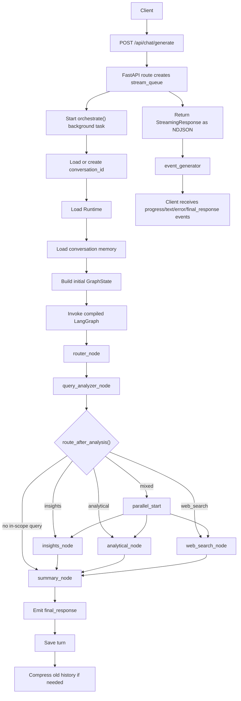

# RAG Chatbot

An async FastAPI chatbot that routes each user request through a LangGraph workflow. The application classifies the query, sends it to the right response node, streams progress and answer text back to the client, then stores the conversation for future turns.

> Note: Some files under `documentation/` describe a larger or older architecture. The current application architecture is defined by the code under `app/`, `runtime/`, and `prompts/`.

## What It Does

- Exposes a streaming chat endpoint at `POST /api/chat/generate`.
- Uses an Anthropic-backed LLM client for classification, answering, synthesis, and memory compression.
- Classifies queries as `insights`, `analytical`, `web_search`, or `out_of_scope`.
- Decomposes complex questions into up to 3 sub-queries.
- Routes single-purpose requests to one node and mixed requests through parallel LangGraph branches.
- Streams NDJSON events to the client while the workflow runs.
- Persists conversation history as JSON files and compresses older history into a summary.

## Project Layout

```text
app/
  main.py                         FastAPI application and lifespan hook
  api/routes.py                   Streaming chat API route
  orchestrator/
    orchestrator_entry.py         Request lifecycle, state setup, memory save/load
    orchestrator_workflow.py      LangGraph nodes and edges
    state.py                      Shared GraphState and result types
    events.py                     Streaming event helpers
  nodes/
    router_node.py                Starts the graph and emits initial progress
    query_analyzer.py             LLM classification, decomposition, scope checks
    insights_node.py              Qualitative answer generation
    analytical_node.py            Quantitative/structured answer generation
    web_search_node.py            Web search plus LLM answer generation
    summary_node.py               Final synthesis and response emission
  memory/conversation_store.py    File-backed conversation persistence
runtime/
  runtime_config.py               Runtime initialization
  llm_client.py                   Anthropic async client wrapper
  prompt_loader.py                YAML prompt loader
prompts/prompts.yaml              System prompts and generation settings
run.py                            Local uvicorn launcher
```

## Request Workflow



## Streaming API

### Request

```http
POST /api/chat/generate
Content-Type: application/json
```

```json
{
  "user_query": "Explain the difference between supervised and unsupervised learning",
  "conversation_id": "optional-existing-conversation-id"
}
```

`conversation_id` is optional. If omitted, the orchestrator generates a UUID and starts a new conversation.

### Response Format

The endpoint returns `application/x-ndjson`. Each line is a JSON event:

```json
{"type":"progress","message":"Analyzing your query...","origin":"system"}
{"type":"text","text":"## Insights\n\n","origin":"insights"}
{"type":"text","text":"Supervised learning...","origin":"insights"}
{"type":"final_response","content":"## Summary\n\n- ..."}
```

Possible event types:

| Type | Meaning |
| --- | --- |
| `progress` | Status update from a graph node |
| `text` | Streamed answer content |
| `error` | User-facing error message |
| `final_response` | Complete response assembled by `summary_node` |

## Local Setup

1. Create and activate a Python virtual environment.
2. Install dependencies:

```powershell
pip install -r requirements.txt
```

3. Configure environment variables, for example in `.env`:

```env
ANTHROPIC_API_KEY=your_api_key
CLAUDE_MODEL=claude-haiku-4-5-20251001
CONVERSATIONS_DIR=conversations
MAX_HISTORY_TURNS=20
KEEP_RECENT_TURNS=10
BRAVE_SEARCH_API_KEY=
```

4. Run the app:

```powershell
python run.py
```

The API will be available at `http://localhost:8000`.

## Runtime Configuration

`runtime/runtime_config.py` initializes:

- `LLMClient`, using `ANTHROPIC_API_KEY` and `CLAUDE_MODEL`.
- `PromptLoader`, reading `prompts/prompts.yaml`.
- The compiled LangGraph from `build_orchestrator_graph()`.

This runtime object is attached to every `GraphState` so nodes can access the LLM client, prompt settings, and compiled workflow.

## Conversation Memory

Conversation state is stored as JSON files in `CONVERSATIONS_DIR`:

```json
{
  "history": [
    {"role": "user", "content": "..."},
    {"role": "assistant", "content": "..."}
  ],
  "summary": "Compressed summary of older turns"
}
```

When history exceeds `MAX_HISTORY_TURNS`, older turns are summarized with the `conversation_summary` prompt and only the latest `KEEP_RECENT_TURNS` messages are retained.

## More Architecture Detail

See `documentation/architecture_overview.md` for the high-level architecture, layer responsibilities, and detailed Mermaid diagrams.
