# LLM Chat Agent

[](LICENSE)
[](requirements.txt)
[](requirements.txt)
[](app/orchestrator/orchestrator_workflow.py)

An async FastAPI service that routes user questions through a LangGraph workflow, streams progress and answer text as NDJSON, and stores conversation memory for follow-up turns.

This repository contains the DS-side application only. The companion UI lives in
[llm-app-agent-frontend_v1](https://github.com/crimsonKn1ght/llm-app-agent-frontend_v1)
and calls this service over HTTP.


## What It Does

- Exposes a streaming chat endpoint at `POST /api/chat/generate`.
- Uses an Anthropic-backed LLM client for classification, answering, synthesis, and memory compression.
- Classifies internal questions as `insights` or `analytical`.
- Optionally runs web search when the request sets `web_search=true`.
- Decomposes complex questions into up to 3 sub-queries.
- Routes single-purpose requests to one node and mixed requests through parallel LangGraph branches.
- Streams `progress`, `text`, `error`, and `final_response` events to clients.
- Persists conversation history as JSON files and compresses older history into a summary.
- Provides lightweight conversation history, search, detail, and status endpoints for compatible frontends.

This is not a classic RAG application at the moment: there is no vector database, embedding index, document chunk retrieval, or retrieval-augmented prompt pipeline in the current code. The only external lookup path is optional web search.

## Project Layout

```text
app/
  main.py                         FastAPI application, CORS, lifespan startup
  api/health.py                   Health and readiness endpoints
  api/routes.py                   Chat streaming and conversation API routes
  orchestrator/
    orchestrator_entry.py         Request lifecycle, state setup, memory save/load
    orchestrator_workflow.py      LangGraph nodes and edges
    state.py                      Shared GraphState and result types
    events.py                     Streaming event helpers
  nodes/
    router_node.py                Starts the graph and emits initial progress
    query_analyzer.py             LLM classification and decomposition
    insights_node.py              Qualitative answer generation
    analytical_node.py            LLM-based quantitative/structured reasoning
    web_search_node.py            Optional web search plus LLM answer generation
    summary_node.py               Final synthesis and response emission
  memory/conversation_store.py    File-backed conversation persistence and lookup
runtime/
  runtime_config.py               Runtime initialization
  llm_client.py                   Anthropic async client wrapper
  prompt_loader.py                YAML prompt loader
prompts/prompts.yaml              System prompts and generation settings
documentation/architecture_overview.md
run.py                            Local uvicorn launcher
```

## API Overview

### Chat Generation

```http
POST /api/chat/generate
Content-Type: application/json
Accept: application/x-ndjson
```

```json
{
  "user_query": "Explain the difference between supervised and unsupervised learning",
  "conversation_id": "optional-existing-uuid",
  "web_search": false
}
```

`conversation_id` is optional. If omitted or invalid, the orchestrator starts a new UUID-backed conversation. `web_search` defaults to `false`.

The response is `application/x-ndjson`, one JSON object per line:

```json
{"type":"progress","message":"Analyzing your query...","origin":"system"}
{"type":"text","text":"## Insights\n\n","origin":"insights"}
{"type":"final_response","content":"## Summary\n\n- ..."}
```

Possible event types:

| Type | Meaning |
| --- | --- |
| `progress` | Status update from a graph node |
| `text` | Streamed answer content |
| `error` | User-facing error message |
| `final_response` | Complete response assembled by `summary_node` |

### Conversation Endpoints

These endpoints use the local JSON conversation store:

| Method | Path | Purpose |
| --- | --- | --- |
| `GET` | `/api/chat/history` | Recent saved conversations |
| `GET` | `/api/chat/search?q=term` | Search saved conversation messages |
| `GET` | `/api/chat/status?conversation_id=<uuid>` | Basic existence and message counts |
| `GET` | `/api/chat/{conversation_id}` | Full conversation history and summary |

### Health And Readiness

| Method | Path | Purpose |
| --- | --- | --- |
| `GET` | `/health` | Basic liveness check |
| `GET` | `/ready` | Runtime readiness check |
| `GET` | `/api/health` | API-prefixed liveness alias |
| `GET` | `/api/ready` | API-prefixed readiness alias |

## Local Setup

Create and activate a Python virtual environment:

```powershell
python -m venv .venv
.\.venv\Scripts\Activate.ps1
```

Install dependencies:

```powershell
pip install -r requirements.txt
```

Create a `.env` file from `.env.example` and set at least:

```env
ANTHROPIC_API_KEY=your_api_key
```

Run the API:

```powershell
python run.py
```

The service listens at:

```text
http://localhost:8000
```

Useful checks:

```powershell
Invoke-RestMethod http://localhost:8000/health
Invoke-RestMethod http://localhost:8000/api/ready
```

## Frontend Integration

A separate frontend can call this service directly.

For local development, allow the frontend origin in `.env`:

```env
URL_ALLOWED_ORIGINS=http://localhost:5173,http://127.0.0.1:5173
```

The frontend should point its API base URL at:

```text
http://localhost:8000
```

The chat UI should consume `POST /api/chat/generate` as an incremental NDJSON stream and can optionally use the conversation endpoints for history, search, and reload.

## Runtime Configuration

| Variable | Required | Default | Purpose |
| --- | --- | --- | --- |
| `ANTHROPIC_API_KEY` | Yes | None | Anthropic API key used by `LLMClient` |
| `CLAUDE_MODEL` | No | `claude-haiku-4-5-20251001` | Model name |
| `LLM_TIMEOUT_SECONDS` | No | `60` | Timeout for each LLM call attempt |
| `LLM_MAX_RETRIES` | No | `2` | Retry count after LLM call failures |
| `CONVERSATIONS_DIR` | No | `conversations` | Conversation JSON storage directory |
| `MAX_HISTORY_TURNS` | No | `20` | Compress once history exceeds this many messages |
| `KEEP_RECENT_TURNS` | No | `10` | Recent messages retained after compression |
| `BRAVE_SEARCH_API_KEY` | No | Empty | Optional fallback for web search |
| `WEB_SEARCH_TIMEOUT_SECONDS` | No | `15` | Timeout for each web search attempt |
| `WEB_SEARCH_MAX_RETRIES` | No | `1` | Retry count after web search failures |
| `URL_ALLOWED_ORIGINS` | No | Local Vite origins | Comma-separated CORS origins for external frontends |

## Architecture Detail

See [`documentation/architecture_overview.md`](documentation/architecture_overview.md) for the current workflow, layers, request lifecycle, and streaming contract.

The diagram below traces one request end to end, from the route handler through the
orchestrator and graph nodes to the final synthesised response.


