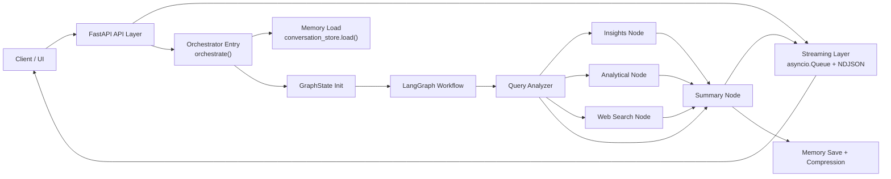
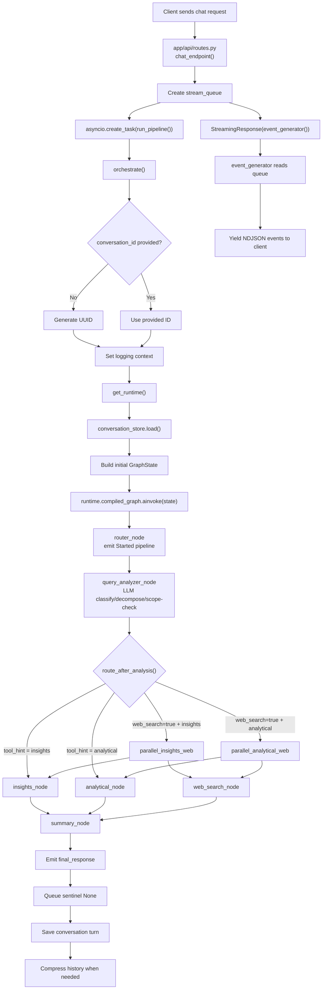
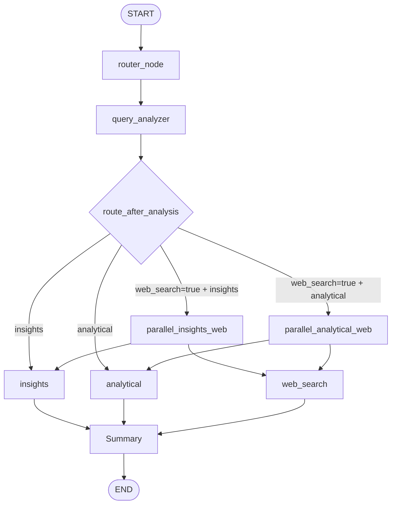
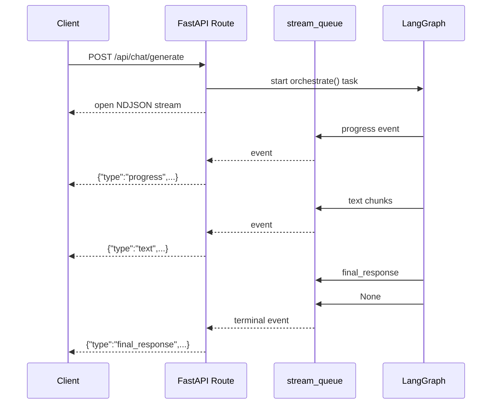

# Architecture Overview

This document describes the current architecture implemented in this repository. It is based on the live code under `app/`, `runtime/`, `prompts/`, and `run.py`.

Some older documentation files in this folder describe a larger architecture with components that are not present in this codebase. Use this file as the source of truth for the current request flow.

## High-Level Architecture

The application is an async FastAPI service backed by a LangGraph workflow. Requests enter through a streaming API route, are normalized into a shared graph state, pass through classification and routing, then produce a final streamed response.



## Main Layers

| Layer | Files | Responsibility |
| --- | --- | --- |
| Application startup | `app/main.py`, `run.py` | Load environment, configure logging, initialize runtime, start FastAPI |
| API layer | `app/api/routes.py` | Accept chat requests, create streaming queue, return NDJSON stream |
| Orchestrator entry | `app/orchestrator/orchestrator_entry.py` | Create conversation ID, load memory, build `GraphState`, invoke LangGraph, save memory |
| Workflow graph | `app/orchestrator/orchestrator_workflow.py` | Define LangGraph nodes, conditional routing, parallel fan-out, final convergence |
| State model | `app/orchestrator/state.py` | Typed shared state and reducer behavior for graph updates |
| Nodes | `app/nodes/*.py` | Query analysis, answer generation, web search, final summary |
| Runtime | `runtime/*.py` | Anthropic client, prompt loading, graph compilation |
| Prompts | `prompts/prompts.yaml` | System prompts, temperatures, and token limits |
| Memory | `app/memory/conversation_store.py` | File-backed conversation history and summarization |

## Request Lifecycle

1. A client sends `POST /api/chat/generate` with `user_query`, optional `conversation_id`, and optional `web_search`.
2. The route creates an `asyncio.Queue` for stream events.
3. The route starts `orchestrate()` in a background task.
4. The route immediately returns a `StreamingResponse` that yields queue events as NDJSON.
5. The orchestrator creates a conversation ID if one was not supplied.
6. The orchestrator loads the runtime and any existing conversation memory.
7. The orchestrator builds the initial `GraphState`.
8. The compiled LangGraph runs the request through router, analyzer, one or more answer nodes, and summary. Web search is added only when `web_search=true`.
9. Nodes emit `progress` and `text` events while they work.
10. `summary_node` emits a `final_response` event and closes the stream.
11. The orchestrator persists the user query and final response.
12. If the conversation is long enough, older turns are compressed into a summary.

## End-to-End Workflow



## LangGraph Workflow

The graph is built in `app/orchestrator/orchestrator_workflow.py`.



### Routing Rules

`query_analyzer_node` asks the LLM to return structured JSON with:

- `query_type`: `insights` or `analytical`
- `is_complex`: whether the query has multiple parts
- `sub_queries`: up to 3 normalized sub-queries
- `tool_hint`: the node that should handle each sub-query

`route_after_analysis()` then routes as follows:

| Condition | Route |
| --- | --- |
| All sub-queries use `insights` | `insights` |
| All sub-queries use `analytical` | `analytical` |
| `web_search=true` with insights | `parallel_insights_web`, then `insights` plus `web_search` run |
| `web_search=true` with analytical | `parallel_analytical_web`, then `analytical` plus `web_search` run |
| Mixed internal tool hints | `parallel_insights_analytical`, then `insights` plus `analytical` run |
| All three tool hints | `parallel_all`, then all agent nodes run |

Web search is request-owned, not analyzer-owned. The analyzer never intentionally emits `web_search`; when the API request sets `web_search=true`, the analyzer node appends a synthetic web sub-query using the original user query. Parallel routes target only the required workflow nodes.

## GraphState

`GraphState` is the shared state object passed between LangGraph nodes.

Important fields:

| Field | Purpose |
| --- | --- |
| `user_query` | Original user request |
| `conversation_id` | Current conversation identifier |
| `web_search` | Request flag that controls whether the web search node is included |
| `conversation_history` | Recent message history |
| `conversation_summary` | Compressed older history |
| `query_type` | LLM-classified query category |
| `is_complex` | Whether the analyzer decomposed the query |
| `sub_queries` | Normalized in-scope sub-queries |
| `agent_results` | Results from answer nodes and out-of-scope handling |
| `source_contents` | Per-source rendered content used by summary |
| `final_response` | Complete final answer |
| `stream_queue` | Queue used to stream events to the API layer |
| `runtime` | LLM client, prompt loader, compiled graph |
| `execution_path` | Audit trail of executed graph nodes |

Reducer behavior:

- `agent_results` uses `operator.add`, so branch results are appended.
- `execution_path` uses `operator.add`, so node names accumulate.
- `completed_branches` uses `operator.add`.
- `source_contents` uses dictionary merge, so each source contributes its text.

## Node Responsibilities

### `router_node`

Starts the graph, emits a `"Started pipeline"` progress event, and records execution path.

### `query_analyzer_node`

Builds a prompt using the current query plus conversation summary/history. It calls the LLM with the `query_analyzer` prompt, parses JSON output, normalizes the result to `insights` or `analytical`, appends a synthetic web sub-query when `web_search=true`, and sets `expected_branches`.

If analyzer parsing or generation fails, it falls back to a single internal sub-query: `analytical` for quantitative patterns, otherwise `insights`.

### `insights_node`

Handles qualitative or explanatory questions. It streams a `## Insights` section. For one matching sub-query it streams the LLM answer directly. For multiple matching sub-queries it generates answers concurrently and synthesizes them with the `source_synthesis` prompt.

### `analytical_node`

Handles quantitative or structured reasoning questions with LLM-based analytical reasoning. It does not execute database-backed analytics or code; its mechanics mirror `insights_node`, but it uses the `analytical` prompt and streams a `## Analysis` section.

### `web_search_node`

Runs only when the request sets `web_search=true`. It searches with DuckDuckGo first, optionally falls back to Brave Search if `BRAVE_SEARCH_API_KEY` is configured, formats results for the LLM, and streams a `## Web Search` answer.

### `summary_node`

Creates the final response. If all useful work was out-of-scope, it returns the out-of-scope message directly. Otherwise, it synthesizes all `source_contents` with the `final_summary` prompt, emits `## Summary`, then assembles the final response as summary plus source sections.

It also emits the terminal `final_response` event and pushes `None` into the queue so the API stream can close.

## Streaming Contract

The API returns `application/x-ndjson`. Each line is one JSON object.



Event types:

| Event | Produced by | Meaning |
| --- | --- | --- |
| `progress` | Nodes via `emit_progress()` | Status update |
| `text` | Nodes via `emit_text()` | Streamed markdown content |
| `error` | Orchestrator error handler | User-facing failure message |
| `final_response` | `summary_node` | Complete response text |

## Runtime and Prompts

Runtime is initialized during FastAPI startup in `app/main.py`.

`runtime/runtime_config.py` creates:

- `LLMClient`, an async Anthropic wrapper.
- `PromptLoader`, which loads `prompts/prompts.yaml`.
- `compiled_graph`, created by `build_orchestrator_graph()`.

The active model defaults to `claude-haiku-4-5-20251001` unless `CLAUDE_MODEL` is set.

Prompt names currently used by nodes:

| Prompt | Used by |
| --- | --- |
| `query_analyzer` | `query_analyzer_node` |
| `insights` | `insights_node` |
| `analytical` | `analytical_node` |
| `web_search` | `web_search_node` |
| `source_synthesis` | Multi-sub-query node synthesis |
| `final_summary` | `summary_node` |
| `conversation_summary` | Memory compression |

## Conversation Memory

Memory is file-backed and implemented in `app/memory/conversation_store.py`.

By default, conversation files are written under `conversations/`:

```text
conversations/
  <conversation_id>.json
```

Each file contains:

```json
{
  "history": [
    {"role": "user", "content": "..."},
    {"role": "assistant", "content": "..."}
  ],
  "summary": "..."
}
```

At the beginning of a request, memory is loaded and attached to `GraphState`.

At the end of a successful request, the new user/assistant turn is appended. If history length exceeds `MAX_HISTORY_TURNS`, older turns are summarized and the latest `KEEP_RECENT_TURNS` are retained.

## Environment Variables

| Variable | Required | Default | Purpose |
| --- | --- | --- | --- |
| `ANTHROPIC_API_KEY` | Yes | None | Anthropic API key used by `LLMClient` |
| `CLAUDE_MODEL` | No | `claude-haiku-4-5-20251001` | Model name |
| `LLM_TIMEOUT_SECONDS` | No | `60` | Timeout for each LLM call attempt |
| `LLM_MAX_RETRIES` | No | `2` | Retry count after LLM call failures before surfacing an error |
| `CONVERSATIONS_DIR` | No | `conversations` | Conversation JSON storage directory |
| `MAX_HISTORY_TURNS` | No | `20` | Compress once history exceeds this many messages |
| `KEEP_RECENT_TURNS` | No | `10` | Recent messages retained after compression |
| `BRAVE_SEARCH_API_KEY` | No | Empty | Optional fallback for web search |
| `WEB_SEARCH_TIMEOUT_SECONDS` | No | `15` | Timeout for each web search provider attempt |
| `WEB_SEARCH_MAX_RETRIES` | No | `1` | Retry count after web search timeouts/failures |

## Important Implementation Notes

- The route streams results while the graph is still running; clients should process NDJSON incrementally.
- The graph always goes through `query_analyzer_node`; internal routing is based on analyzer output.
- Web search is controlled only by the `web_search` request field.
- Mixed requests fan out only to the required answer nodes.
- `summary_node` is the final convergence point for both single-node and parallel paths.
- Conversation saving happens in `finally`, but only if a final response was produced.
- Web search uses network-backed providers and can return limited results if those providers fail.
